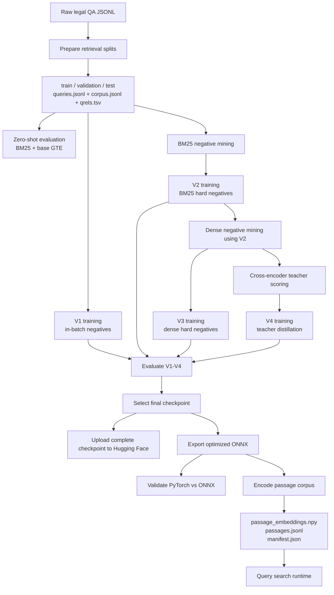

# Legal Embedding Workflow

This document explains how the repository entry points, configurations, data
files, checkpoints, reports and release artifacts depend on one another.

Run commands from the repository root. On the cluster, first expose `src/` as
an import root:

```bash
export PYTHONPATH="$PWD/src${PYTHONPATH:+:$PYTHONPATH}"
```

## End-to-end flow



## Repository entry points

| Stage | Entry point | Configuration | Main output |
|---|---|---|---|
| Data preparation | Not currently present | `src/configs/embed/prepare.yaml` | Retrieval splits |
| BM25/dense/teacher mining | `src/mining/mine.py` | Mining YAML | Negative or teacher JSONL and report |
| V1-V3 training | `src/training/main.py` | Training YAML | SentenceTransformer checkpoint |
| V4 training | `src/training/distill.py` | `train_v4_distillation.yaml` | Distilled checkpoint |
| Evaluation | `src/evaluate/evaluate.py` | Command-line arguments | JSON and Markdown reports |
| Hugging Face upload | `src/release/upload_huggingface.py` | Command-line arguments | Public/private Hub repositories |
| ONNX export | `src/release/export_onnx.py` | Command-line arguments | Deployable ONNX model directory |
| ONNX validation | `src/release/validate_onnx.py` | Currently hard-coded | Console benchmark |
| Passage indexing | `src/release/build_passage_index.py` | Command-line arguments | Embeddings, passage rows and manifest |
| Search | `src/inference/search.py` | Command-line arguments | Ranked passages as JSON |

## 1. Retrieval data

Each split is represented by three files:

```text
data/processed/embed/
├── train/
│   ├── queries.jsonl
│   ├── corpus.jsonl
│   └── qrels.tsv
├── validation/
│   ├── queries.jsonl
│   ├── corpus.jsonl
│   └── qrels.tsv
└── test/
    ├── queries.jsonl
    ├── corpus.jsonl
    └── qrels.tsv
```

The roles are:

- `queries.jsonl`: `query_id` and query text.
- `corpus.jsonl`: `passage_id`, passage text and available metadata.
- `qrels.tsv`: positive query-to-passage relevance relationships.

`src/data/load.py` loads these objects for evaluation, mining and training.

The repository currently contains `src/configs/embed/prepare.yaml`, but no
data-preparation Python entry point. Therefore, the processed split files are
currently a prerequisite rather than something reproducible from this
repository alone.

## 2. Baseline and checkpoint evaluation

`src/evaluate/evaluate.py` selects BM25 when `--model bm25` is supplied.
Every other value is loaded as a SentenceTransformer path or Hugging Face model
ID.

Dense evaluation:

1. encodes all queries with normalized embeddings;
2. encodes all passages with normalized embeddings;
3. calculates the query-passage dot-product matrix;
4. ranks every passage for each query;
5. calculates NDCG, recall and MRR;
6. saves aggregate metrics and per-query ranks.

Because embeddings are normalized, dot product is equivalent to cosine
similarity.

Evaluate the validation set:

```bash
python src/evaluate/evaluate.py \
  --model artifacts/checkpoints/embed/gte-modernbert-base-v2-bm25/final \
  --split data/processed/embed/validation \
  --output reports/experiments/embed/validation_all \
  --batch-size 32 \
  --device cuda \
  --trust-remote-code
```

The evaluator writes one `.json` file and one `.md` file for each model. The
JSON report includes `per_query`, which can be used to compare where one model
succeeds and another fails.

Evaluation uses the PyTorch SentenceTransformer checkpoint. It does not
evaluate the exported ONNX model.

## 3. Training dependency chain

The complete sequence is implemented by:

```bash
sbatch scripts/slurm/train_all.sh
```

The script runs the following stages sequentially and stops when a command
fails.

### V1: in-batch negatives

```bash
python src/training/main.py \
  --config src/configs/embed/train.yaml
```

Inputs:

- training queries, corpus and qrels;
- base model `Alibaba-NLP/gte-modernbert-base`.

Output:

```text
artifacts/checkpoints/embed/gte-modernbert-base/final/
```

### BM25 hard-negative mining

```bash
python src/mining/mine.py \
  --config src/configs/embed/mine_bm25.yaml
```

Outputs:

```text
data/interim/embed/negatives/bm25/train.jsonl
reports/data/embed/bm25_hard_negatives.json
```

These negatives are consumed by V2 training.

### V2: BM25 hard negatives

```bash
python src/training/main.py \
  --config src/configs/embed/train_v2_bm25.yaml
```

Output:

```text
artifacts/checkpoints/embed/gte-modernbert-base-v2-bm25/final/
```

### Dense hard-negative mining

```bash
python src/mining/mine.py \
  --config src/configs/embed/mine_dense.yaml
```

`mine_dense.yaml` uses the completed V2 checkpoint as its retrieval model.

Outputs:

```text
data/interim/embed/negatives/dense/train.jsonl
reports/data/embed/dense_hard_negatives.json
```

### V3: dense hard negatives

```bash
python src/training/main.py \
  --config src/configs/embed/train_v3_dense.yaml
```

Output:

```text
artifacts/checkpoints/embed/gte-modernbert-base-v3-dense/final/
```

### Teacher candidate scoring

```bash
python src/mining/mine.py \
  --config src/configs/embed/score_teacher.yaml
```

This stage does not train the student. It takes the candidates already produced
by dense mining and assigns cross-encoder teacher scores.

Outputs:

```text
data/interim/embed/teacher/cross_encoder/train.jsonl
reports/data/embed/cross_encoder_teacher_scores.json
```

### V4: teacher distillation

```bash
python src/training/distill.py \
  --config src/configs/embed/train_v4_distillation.yaml
```

V4 consumes the teacher-scored candidate lists. Its current configuration starts
the student from `Alibaba-NLP/gte-modernbert-base`; it does not continue
training from the V3 checkpoint.

Output:

```text
artifacts/checkpoints/embed/gte-modernbert-base-v4-distillation/final/
```

## 4. Training outputs and W&B

Every training configuration defines:

- input retrieval data;
- model and sequence length;
- effective and physical mini-batch sizes;
- optimizer settings;
- checkpoint directory;
- JSON report path;
- W&B project, group, run name and tags.

The four final report paths are:

```text
reports/experiments/embed/embed_v1.json
reports/experiments/embed/embed_v2_bm25.json
reports/experiments/embed/embed_v3_dense.json
reports/experiments/embed/embed_v4_distillation.json
```

W&B logging is implemented by `src/training/callback.py`. It records training
loss during the run and validation retrieval metrics after each epoch.

## 5. Tokenizer compatibility

Some checkpoints were saved with Transformers 5 metadata:

```json
"tokenizer_class": "TokenizersBackend"
```

Transformers 4.57 cannot resolve that class. For compatibility with the current
cluster environment, the checkpoint metadata should instead contain:

```json
"tokenizer_class": "PreTrainedTokenizerFast"
```

This changes tokenizer metadata only; it does not change trained weights.
Apply the correction to V1-V4 before evaluation, upload or ONNX export.

## 6. Hugging Face publishing

First perform the uploader's validation-only dry run:

```bash
python src/release/upload_huggingface.py \
  --namespace Sing0402 \
  --variants v1 v2 v3 v4 \
  --no-private
```

Then upload the complete checkpoint folders publicly:

```bash
python src/release/upload_huggingface.py \
  --namespace Sing0402 \
  --variants v1 v2 v3 v4 \
  --no-private \
  --execute
```

The uploader publishes:

| Variant | Hugging Face repository |
|---|---|
| V1 | `Sing0402/legal-embed-gte-inbatch` |
| V2 | `Sing0402/legal-embed-gte-bm25` |
| V3 | `Sing0402/legal-embed-gte-dense` |
| V4 | `Sing0402/legal-embed-gte-distilled` |

The complete SentenceTransformer directory must be uploaded, not only
`model.safetensors`.

## 7. ONNX export

`src/release/export_onnx.py` accepts either a local checkpoint directory or a
Hugging Face model ID.

GPU FP16 export from a local checkpoint:

```bash
python src/release/export_onnx.py \
  --model artifacts/checkpoints/embed/gte-modernbert-base/final \
  --output-dir artifacts/releases/legal-embed-gte-inbatch/gpu \
  --target gpu
```

CPU FP32 plus AVX2 INT8 export:

```bash
python src/release/export_onnx.py \
  --model artifacts/checkpoints/embed/gte-modernbert-base/final \
  --output-dir artifacts/releases/legal-embed-gte-inbatch/cpu \
  --target cpu \
  --quantize-int8
```

Use `--overwrite` only when intentionally replacing an existing release
directory.

Expected optimized files include:

```text
onnx/model_gpu_fp16.onnx
onnx/model_cpu_fp32.onnx
onnx/model_cpu_qint8_avx2.onnx
```

Only the files for the selected export command will be present.

## 8. ONNX validation

The intended validation stage should:

1. encode identical inputs with the selected PyTorch checkpoint and ONNX file;
2. compare embedding shapes;
3. compare cosine similarity or maximum absolute error;
4. verify retrieval rankings;
5. measure startup, latency and throughput;
6. write a validation report.

`src/release/validate_onnx.py` is not yet a general validation entry point. It
currently combines a CPU model directory with `CUDAExecutionProvider` and
references `onnx/model_cpu_fp16.onnx`, which the exporter does not create.
Convert it to command-line arguments before treating ONNX validation as a
release gate.

## 9. Passage-index construction

The dense index consists of:

```text
passage_embeddings.npy
passages.jsonl
manifest.json
```

The rows of `passages.jsonl` and `passage_embeddings.npy` have identical order.
The manifest records the exact ONNX model hash, corpus hashes, embedding
dimension, normalization and similarity function.

Build a GPU deployment index containing all QA passages:

```bash
python src/release/build_passage_index.py \
  --model-dir artifacts/releases/legal-embed-gte-inbatch/gpu \
  --corpus \
    data/processed/embed/train/corpus.jsonl \
    data/processed/embed/validation/corpus.jsonl \
    data/processed/embed/test/corpus.jsonl \
  --output-dir artifacts/indexes/legal-embed-gte-inbatch/all-qa \
  --target gpu \
  --batch-size 64
```

Combining train, validation and test is appropriate for a final demonstration
or deployment index after evaluation is complete. For evaluation, index only
the corpus belonging to the evaluated split.

The current index performs exact NumPy dot-product search. This is suitable for
the small QA corpus. A much larger production corpus should use an approximate
nearest-neighbour index such as FAISS or HNSW.

## 10. Search

The current retriever expects the GPU FP16 ONNX model and normalized passage
embeddings:

```bash
PYTHONPATH=src python src/inference/search.py \
  --model artifacts/releases/legal-embed-gte-inbatch/gpu \
  --embeddings artifacts/indexes/legal-embed-gte-inbatch/all-qa/passage_embeddings.npy \
  --passages artifacts/indexes/legal-embed-gte-inbatch/all-qa/passages.jsonl \
  --query "What factors determine whether bail should be granted?" \
  --top-k 5
```

Runtime processing is:

```text
query
→ ONNX query embedding
→ L2 normalization
→ dot product against passage_embeddings.npy
→ top-k passage metadata
→ JSON response
```

`src/inference/retriever.py` currently hard-codes
`CUDAExecutionProvider` and `onnx/model_gpu_fp16.onnx`. It must be made
configurable before the same search entry point can serve CPU releases.

## 11. Output ownership

```text
data/raw/                         source dataset
data/processed/embed/             immutable retrieval splits
data/interim/embed/negatives/     mined BM25 and dense negatives
data/interim/embed/teacher/       teacher-scored candidates
artifacts/checkpoints/embed/      training checkpoints
artifacts/releases/               exported deployable models
artifacts/indexes/                passage indexes
reports/data/embed/               preparation and mining reports
reports/experiments/embed/        training and evaluation reports
```

Large generated data, checkpoints, ONNX files and indexes should remain outside
Git unless explicitly managed with an artifact store.

## 12. Common failure points

- Run commands from the repository root.
- Set `PYTHONPATH` to the repository's `src/` directory.
- Use `from mining.util ...`, not `from util ...`, in mining modules.
- Check tokenizer metadata when loading a Transformers 5 checkpoint with
  Transformers 4.
- Set `HF_HOME` to writable scratch storage on the cluster.
- GPU ONNX requires `CUDAExecutionProvider`; do not silently fall back to CPU.
- Use the same ONNX model file for passage indexing and query serving.
- Use `--overwrite` only when replacing known release or index outputs.
